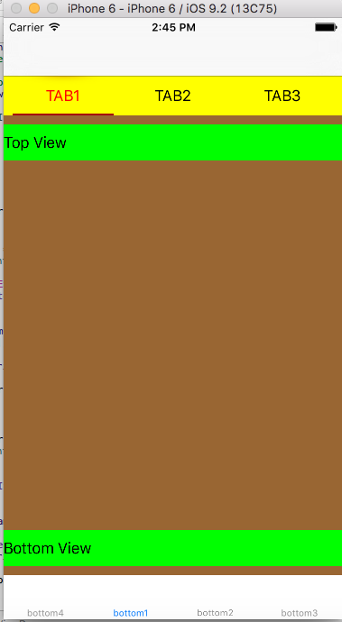

<!-- 
提交到cocoapods中：
1.
pod spec lint --sources='https://github.com/CocoaPods/Specs' WSPagesViewController.podspec --verbose

2.
pod spec lint --sources='https://github.com/CocoaPods/Specs' WSPagesViewController.podspec --allow-warnings

3.
pod repo push trunk WSPagesViewController.podspec --allow-warnings
 -->

WSPagesViewController
==============

可滚动的容器

Features
==============

- 自适应navigationbar，tabbar等控件。无需再重新计算

Installation
==============

CocoaPods
--------------
Install CocoaPods if necessary:

    $ [sudo] gem install cocoapods
    $ pod setup

Change to the directory of your Xcode project:

    $ cd /path/to/MyProject
    $ touch Podfile
    $ edit Podfile

Edit your Podfile and add WSPagesViewController:

    platform :ios, '7.0'
    pod 'WSPagesViewController'

Install into your Xcode project:

    $ pod install

From now on open your project in Xcode from the .xcworkspace file (instead of the usual project file)

Manual Install
--------------

Just drag and drop WSPagesViewController folder into your project.

TODO
==============

-	现在为0.0.1版本，后续会继续优化

